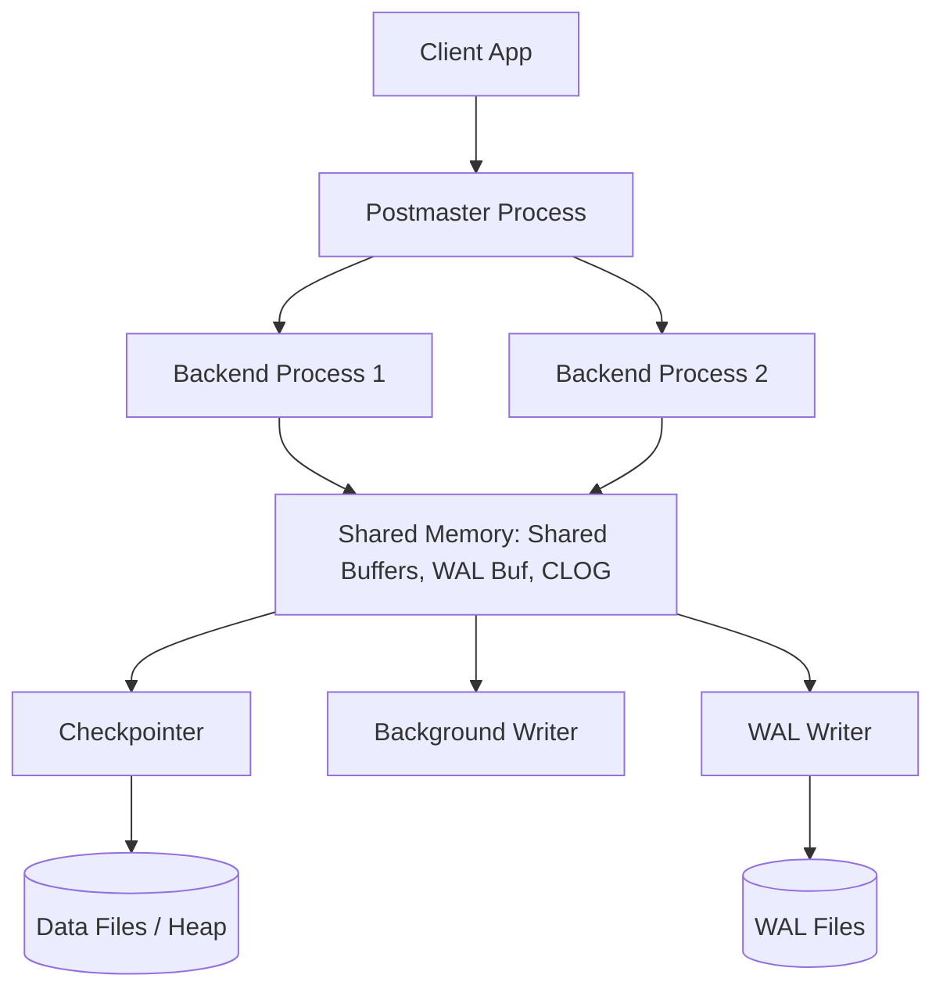

# 🎯 Increment 01: PostgreSQL Architecture Overview (vs MySQL)

**Duration**: 45 minutes  
**Difficulty**: ⭐⭐⭐ Intermediate

## 📋 Quick Summary

Understanding the difference between MySQL's **Thread-based** architecture and PostgreSQL's **Process-based** architecture is fundamental for senior developers. It explains why they scale differently and how you tune them.

**Key Concepts**:
- **Process per Connection**: Every client gets its own backend process.
- **Shared Memory**: How processes communicate (Shared Buffers, WAL Buffer).
- **Background Processes**: The "crew" that keeps the DB running (Checkpointer, BGWriter).
- **Disk Layout**: The "Heap" - where your data actually lives.

---

## 🎓 Theory (20 minutes)

### 1. Process-based vs Thread-based

| Feature | MySQL (InnoDB) | PostgreSQL |
|---------|---------------|------------|
| Concurrency | Single process, many threads | Many processes (Postmaster + Backends) |
| Memory Isolation | Shared memory space | Private memory per process + Shared Buffers |
| Connection Cost | Low (thread creation) | Higher (process forking) |
| Failure Impact | Thread crash can kill process | Process crash is isolated (but triggers recovery) |

> [!IMPORTANT]
> Because PostgreSQL forks a process for every connection, **Connection Pooling** (like PgBouncer) is mandatory for high-scale PostgreSQL apps. MySQL can often handle thousands of connections natively; PostgreSQL usually hits a wall around 500-1000 without a pooler.

### 2. The Architecture Map



### 3. Background "Workers"

- **Postmaster**: The parent process. Listens for connections and forks backends.
- **Backend Process**: Handles your SQL, local memory (`work_mem`), and interacts with shared memory.
- **WAL Writer**: Periodically flushes WAL buffers to disk. Improves performance by not waiting for every COMMIT to sync.
- **Checkpointer**: Periodically flushes "dirty pages" from Shared Buffers to the actual data files.

---

## 🧪 Hands-On Exercises (20 minutes)

### Exercise 1: Inspecting Processes

PostgreSQL processes are visible at the OS level.

```bash
# In your terminal
docker exec -it postgresql-primary ps aux | grep postgres
```

**Look for**:
- `postmaster` (process 1)
- `checkpointer`
- `background writer`
- `walwriter`
- `autovacuum launcher`
- `logical replication launcher`

### Exercise 2: Viewing Current Backends via SQL

```sql
-- See all active connections and what they are doing
SELECT pid, usename, application_name, client_addr, state, query 
FROM pg_stat_activity 
WHERE state != 'idle';
```

### Exercise 3: Identifying the "Data" on Disk

In PostgreSQL, every database is a folder, and every table is a file.

```sql
-- Find the OID (Object ID) of our database
SELECT datname, oid FROM pg_database WHERE datname = 'learning_db';

-- Find the file path for the 'users' table
SELECT pg_relation_filepath('users');
```

Then, look at the files:
```bash
docker exec -it postgresql-primary ls -lh /var/lib/postgresql/data/base/<DATABASE_OID>/<FILE_NODE>
```

---

## 🎤 Interview Question Practice

**Q1**: "Why is connection pooling more critical for PostgreSQL than for MySQL?"

**Answer**: PostgreSQL uses a process-per-connection model. Forking a process is more resource-intensive (CPU/Memory) than spawning a thread. Additionally, IPC (Inter-Process Communication) and managing many process states can become a bottleneck at high connection counts.

**Q2**: "What happens when a PostgreSQL backend process crashes?"

**Answer**: The Postmaster detects the crash. To ensure data integrity, it stops all other backend processes, resets the shared memory region, and performs a brief crash recovery using the WAL before allowing new connections. This is why "isolated" crashes in PG still cause a momentary blip for all users.

---

## ✅ Completion Checklist

- [ ] Explain why PostgreSQL uses multiple processes
- [ ] List 3 major background processes and their roles
- [ ] Locate the physical data file for a specific table
- [ ] Understand why `PgBouncer` is a common component in PG stacks

## 🔗 Next: Increment 02 - Shared Buffers & Memory Management
Ready to dive into the most important memory region of PostgreSQL?
